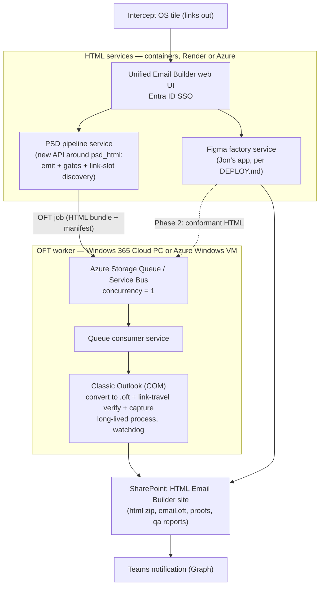

# PRD — Email Builder Distribution (Figma + PSD → HTML / OFT)

*Draft for the Francis / Adrian regroup. Prepared by Jason / Karl / Alan per the 2026-07 briefing meeting ("put together a PRD and all of your open questions on the workflow and what's required").*

*Status: draft v0.1 — recommendations are marked; unresolved items live in the Open Questions Register (§9) with owners.*

---

## 1 · Summary

Distribute the two internally built email tools — **Jon's Figma → HTML factory** and **Kai's PSD → HTML → OFT pipeline** — to the whole company as one **"Email Builder"** entry in Intercept OS, replacing the outsourced HTML/OFT coding step.

- **HTML production** runs in the cloud (containerized; both tools' HTML halves are OS-agnostic).
- **OFT production** runs on a dedicated Windows worker with classic Outlook (an M365-native Windows 365 Cloud PC or Azure Windows VM), behind a job queue — with a parallel spike to evaluate library-based OFT generation (MsgKit / Aspose) as a future cloud-native replacement.
- Outputs (HTML zip, `email.oft`, QA/capture proofs) are delivered to the shared **HTML Email Builder SharePoint** site, with Teams notifications.

### Goals

1. Any designer/producer can build a QA-gated email (HTML and, where required, OFT) without freelancers, from a browser.
2. OFT capability is preserved end-to-end — OFT is a hard client requirement regardless of volume; today only 1–2 designers can author OFTs.
3. Both design intakes (Figma and Photoshop) are served; clients and designers use both.
4. Distribution does not degrade either tool's QA guarantees (fidelity gates, link verification, capture proof).

### Non-goals (deliberately out of scope, per both tools' boundaries)

- Copy approval, CDN/image hosting, ESP loading (Marketo/SFMC), and send scheduling stay with the campaign team.
- Replacing either tool's core pipeline — this PRD is about **distribution and integration**, not re-architecture of the converters.
- External/client-facing access (internal-only for now).

---

## 2 · Background

**Today's workflow:** designs are authored in Figma and/or Photoshop (client- and designer-dependent), then sent to an external developer who hand-codes the HTML and the OFT. That costs a build fee plus turnaround days per email, times every revision round. OFT files returned often drift visually from the authored design. Only 1–2 designers in-house can author OFTs.

**The two tools (deliberate split by intake, same goal):**

| | Jon — Figma Email Factory | Kai — PSD → HTML → OFT |
|---|---|---|
| Input | Figma frame link (Dev Mode) | PSD authored to SOP + link URLs |
| Output | QA-gated HTML zip for ESP (`send.html`, previews, assets, `qa-report.json`) | HTML bundle **and** `email.oft` + capture proof + link-travel report |
| QA | Pixel diff ≤7%, band drift ≤4px, ink delta ≤2.5pp vs Figma's own render; client-safe lint | Intake gate, per-region fidelity gate vs the PSD, Grammar-G conformance, link-travel verify into the OFT, Word-engine capture |
| OFT | **No** | **Yes** — via classic Outlook COM (`SaveAs olTemplate`), Windows-only |
| Runtime | Node; web app + CLI; **Dockerfile + `DEPLOY.md` already exist** (Render/Docker) | Python (`psd-html`) + PowerShell/Outlook COM; **desktop GUI only, no web UI today** |
| Maturity | Real campaigns gate-passed (Lenovo, AMD, Microsoft×Intel, Copilot, higher-ed); ~800 tests; not yet the production path | 527 tests passing; proven end-to-end on one email; capture step is spike-grade |

**Key architectural fact:** Kai's pipeline is HTML-first — the OFT is packaged *from* the emitted HTML by classic Outlook (COM). That means (a) the HTML half is cloud-friendly on its own, and (b) the OFT back half could later also serve Jon's HTML (§7 Phase 2).

**Decision already made:** OFT support is **mandatory** — some clients require `.oft` deliverables, so the capability must exist regardless of its share of volume. Volume only affects investment priority.

---

## 3 · Users & workflows

| Role | What they do in the distributed system |
|---|---|
| **Designer** | Authors in Figma (per Jon's design rules) or Photoshop (per Kai's SOP). Never installs tooling. |
| **Operator / producer** (non-technical) | Opens the Email Builder from Intercept OS → pastes a Figma link **or** uploads a PSD → fills the link-URL form (PSD path) → watches gates run → downloads artifacts from SharePoint / the result page. |
| **Campaign team** | Consumes the deliverable: HTML zip to ESP, or `email.oft` to the client; works the "before send" checklist. |
| **On-call owner (eng)** | Monitors the queue and the Windows OFT worker; handles stuck jobs. |

Happy path, PSD job: upload PSD → intake gate (fails loud with layer names) → link form (one row per discovered slot) → emit + fidelity gate + conformance (cloud) → OFT convert + link-travel verify + capture (Windows worker) → artifacts to SharePoint + Teams ping. Target: minutes, not days.

---

## 4 · Target architecture

### Component notes

- **Unified web UI** — thin front end, two intakes (Figma link / PSD upload), job status, artifact links. *Shape is an open question (OQ-1): new app vs extending Jon's web app vs two tiles near-term.*
- **PSD pipeline service (new)** — wraps the existing Python package: `psd-html emit` + fidelity gate + conformance, plus a web port of the GUI's "Edit links…" form. Slot discovery already exists as pure Python ([src/psd_html/link_scaffold.py](../src/psd_html/link_scaffold.py)); the desktop dialog in [gui/PsdDropper.pyw](../gui/PsdDropper.pyw) is the reference UX. Async job model (emit + gate can take 60–120 s, past HTTP timeouts).
- **OFT worker** — runs Kai's existing converter ([grammar/Convert-HtmlToOft.ps1](../grammar/Convert-HtmlToOft.ps1) → `ConvertTo-CreativeQaOft`) as a queue consumer. Requirements from the tool's own docs: interactive console session kept alive, 100 % display scaling for capture, design fonts installed, **one job at a time**, long-lived Outlook process with watchdog (this is Kai's own "production capture worker" roadmap item). M365 makes this cheap: Cloud PC is Entra-joined and Intune-managed, classic Outlook is covered by existing M365 Apps licensing, and the Outlook profile signs into an Entra service mailbox.
- **Queue** — Azure Storage Queue or Service Bus; reachable from Render if the split-vendor hosting is kept (see §6).
- **Artifacts** — SharePoint is already the designated working-files home per Kai's briefing; Graph API posts a Teams message on completion/failure.

---

## 5 · OFT production — options considered

| Option | How | Verdict |
|---|---|---|
| **A. Classic Outlook COM worker** (current pipeline) | Outlook loads the HTML, Word engine normalizes it, `SaveAs olTemplate`; link-travel verify + capture proof run on the same worker | **Recommended for Phase 1.** Highest fidelity to the actual target (classic Outlook), preserves all existing QA guarantees; cost is Windows infra + serialized jobs |
| **B. MsgKit (open source, .NET)** | HTML → EML → MSG/OFT bytes written directly; runs in Linux Docker, no Outlook | **Spike in parallel.** Free, cloud-native; bypasses Word-engine normalization, so fidelity (CID/VML images, editability semantics) must be proven on real campaigns before trusting |
| **C. Aspose.Email (commercial)** | Same shape as B with a mature commercial library (`MailMessage.Save(..., DefaultOft)`) | Fallback if MsgKit fidelity fails; licensing cost; same "no Word engine / no capture proof" caveat |
| **D. Microsoft Graph API** | Create drafts/messages in cloud mailboxes | **Rejected for OFT** — Graph cannot produce `.oft` files at all. Retained as the Teams-notification mechanism and a possible future "create test draft" feature |
| **E. Power Automate flow** | HTTP trigger → compose MIME text → SharePoint file | **Rejected** — produces EML, not OFT; the naive compose misses multipart CID-embedded images; requires a premium connector license to do what ~20 lines of Python stdlib already do |

**EML export** (requested by Claudia & Daphne) is a cheap add-on regardless of the option chosen: the pipeline already produces HTML + cid assets, and an `.eml` is that bundle in a standard MIME envelope — implemented in the Python service, no external infra.

**Phased recommendation:** ship A now; run B (fallback C) as a time-boxed fidelity spike with designer sign-off criteria (OQ-8); revisit after Phase 1 to decide whether the Windows worker can be retired or stays as the QA/capture leg only.

---

## 6 · Hosting

**Phase 1 recommendation (pending security review, OQ-2/OQ-3):**

- **HTML services on Render** — Jon's `DEPLOY.md` already targets it and team members have shipped on it. Stateless builds fit a PaaS well.
- **OFT worker on the Microsoft side** — Windows 365 Cloud PC (preferred: pure M365 licensing/ops) or an Azure Windows 11 VM.
- **Cross-vendor caveat:** the job queue must be reachable from both (Azure Storage Queue works from Render via connection string). This plumbing, and the fact that **client design files would transit and be processed on Render (outside the Microsoft tenant)**, are explicit review items — a data-handling constraint could veto Render and force consolidation onto Azure (Container Apps / App Service), which remains the clean single-vendor alternative.

---

## 7 · Phases

### Phase 0 — Pilot (validate before building)
- Deploy Jon's factory per `DEPLOY.md` to a staging URL; run real Figma campaigns through it.
- Stand up one Cloud PC/VM manually; run Kai's full pipeline (including capture) on real PSDs via RDP.
- Run the MsgKit fidelity spike: same HTML through COM and MsgKit, designers compare the two `.oft`s in classic Outlook.
- **Exit criteria:** N real campaigns pass each tool (N = OQ-4); security review verdict on Render; spike verdict recorded.

### Phase 1 — Distribute
- Build the PSD pipeline service (web API + link form) and the thin unified UI (shape per OQ-1).
- Worker-ize the OFT leg: queue consumer, long-lived Outlook, watchdog, single-slot concurrency; SharePoint delivery + Teams notify.
- Entra SSO on the UI; upload limits, temp cleanup, fonts installed on the worker.
- Add the Intercept OS tile.
- **Exit criteria:** an operator with no HTML skill completes Figma→HTML and PSD→OFT jobs end-to-end from a browser; on-call owner named.

### Phase 2 — Converge
- **Figma → OFT:** route Jon's HTML through the OFT back half (convert + link-verify + capture). Requires Jon's output to pass the same Word-safe conformance rules — "some adaptation, not drop-in" per Kai's briefing; scope with Jon (OQ-5).
- EML export toggle; modern-Outlook support per Kai's roadmap.
- Act on the library-spike verdict (retire, keep, or hybridize the Windows worker).
- Scale workers (one Outlook per worker, N workers) only if volume demands (OQ-4).

---

## 8 · Security & data handling

From Kai's briefing (residual risks) plus distribution-specific items:

- **Trust-model change:** both tools currently treat inputs as trusted local files. A web intake needs auth (Entra SSO), upload size/type limits, per-job temp isolation and cleanup.
- **Client assets off-tenant:** PSDs/Figma exports for Microsoft/Intel/AMD/Lenovo campaigns processed on Render — needs legal/account-lead sign-off (OQ-2).
- **Artifacts carry real personalization:** stored HTML and capture PNGs hold merge fields and live campaign URLs — SharePoint site permissions must be scoped; no artifacts in build logs.
- **Tracking beacons:** by design the emails keep remote image/tracking URLs; previews fired from cloud services will ping them — decide whether preview rendering should block remote loads.
- **Existing controls carry over:** URL-scheme allowlist, no code-execution paths, path-traversal containment, COM safety (attach-don't-kill), pinned deps + CI scanning.
- **Service account hygiene:** the worker's Outlook signs into a dedicated Entra service mailbox (never a person's); credentials in a vault; the worker sends nothing (send-verify stays out of the shared service).

---

## 9 · Open Questions Register

| # | Question | Why it matters | Owner to ask |
|---|---|---|---|
| OQ-1 | Front-end shape: one new thin UI over two backend services, extend Jon's existing web app, or two tiles near-term? | Decides who builds/owns the UI and how coupled the tools become | Francis / Adrian / Jon |
| OQ-2 | Client data constraints: may client design files (MS, Intel, AMD, Lenovo) be processed outside our Microsoft tenant (i.e. on Render)? | Can veto the Phase 1 hosting split; forces Azure consolidation | Legal / account leads |
| OQ-3 | Infra inventory: Azure subscription + who administers it; Render account ownership; Windows 365 licenses available? | Confirms the recommended stack is actually provisionable | IT |
| OQ-4 | Volume: emails/month, revision rounds, OFT share, expected concurrent users? | Sizes workers and decides pilot exit criteria (N campaigns) | Shivani |
| OQ-5 | Jon: any OFT plans of his own? Willing to adapt factory HTML to the Word-safe conformance rules for Phase 2 Figma→OFT? | Phase 2 feasibility and ownership | Jon |
| OQ-6 | Ownership: who maintains each service post-distribution (Kai hands off or co-owns; who is on-call for the Windows worker)? | Distribution without an owner fails quietly | Francis |
| OQ-7 | Designer UX set: who operates it weekly; willingness to follow the authoring SOPs (Figma rules / PSD layer naming); fail-message expectations; UX dealbreakers; who owns link URLs and the before-send list | Shapes UI and SOP investment; decides adoption | Claudia / Daphne + creative team |
| OQ-8 | Fidelity acceptance for the MsgKit/Aspose spike: who signs off, on how many campaigns, against what criteria (images, editability, links, layout in classic Outlook)? | Gate for retiring the Windows worker | Design leads + Adrian |
| OQ-9 | Intercept OS: who owns tile addition, and what auth does the portal pass through? | The literal front door | Intercept OS owner |
| OQ-10 | Success bar and kill criteria at 30/90 days (e.g. % of email jobs done without freelancers; regression rate vs freelancer output) | Makes the regroup decision concrete | Francis / Adrian |

---

## 10 · Success metrics & kill criteria (proposed — confirm at regroup, OQ-10)

**Success (90 days after Phase 1):**
- ≥ 80 % of new email builds (Figma and PSD) go through the Email Builder with no freelancer involvement.
- OFT jobs complete in < 15 minutes end-to-end (upload → artifact in SharePoint).
- Zero shipped emails with a defect the gates should have caught (copy, links, layout drift beyond tolerance).
- At least 3 operators beyond Jon/Kai run jobs unassisted.

**Kill / rethink criteria:**
- Designers won't author to the SOPs and intake-refusal rates stay high after training.
- The Windows worker requires weekly manual intervention despite the watchdog (then: accelerate the library route or revert OFT to a staffed desktop workflow).
- Security review blocks cloud processing of client files entirely (then: on-prem/VDI-only variant).

---

### Companion material

- Kai's tool briefing: [docs/TOOL_BRIEFING.md](TOOL_BRIEFING.md) (business rules, bug-list coverage, roadmap)
- Kai's authoring SOP: [docs/PSD-for-HTML_Authoring-SOP.md](PSD-for-HTML_Authoring-SOP.md)
- Jon's package: demo video, `docs/DEPLOY.md`, `docs/INTEGRATION.md`, `docs/FIGMA-DESIGN-RULES.md` (in his share folder)
