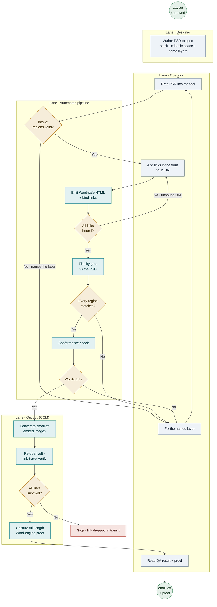

# SOP: PSD → Outlook Email

*How to take a Photoshop email design and turn it into a working, editable Outlook template — end to end.*

> Draft / work in progress. The designer-authoring rules live inside Step 1 of the workflow.

---

## 1 · Who can use the tool

| Role | What they do | What they need to know |
|---|---|---|
| **Designer** | Builds the Photoshop file to spec (Step 1). | Photoshop. No code. Just the layer rules in Step 1. |
| **Operator** | Runs the tool: drops the PSD, adds links, checks the result (Steps 2–5). | How to run a drag-drop app and read a pass/fail. **No HTML.** |
| **Anyone on the team** | Both, once trained. | A short 101 + a Loom walkthrough (coming) makes it paint-by-numbers. |

**Environment note (operator):** the final Outlook template + proof steps need a **Windows machine with classic desktop Outlook** installed. Designers need only Photoshop.

A **fill-in spot** (used throughout) is anything filled in later, per person: `[First Name]`, a company name, the sender's name.

---

## 2 · The workflow, step by step

The flow: **create the PSD → review the components → add links → run the tool → QA / compare.** Each step below lists what you need going in, how it works, and what you get out.

*Circles = events, rectangles = tasks, diamonds = the fail-loud gateways. Every diamond that fails routes back to a fix-and-re-run — nothing bad passes downstream.*

### Step 1 — Create the PSD (the design)

*Who: the designer. In: the approved layout. Out: a PSD the tool can read cleanly.*

How you build the file decides how well the email turns out. Eight small rules:

1. **Stack it top to bottom.** Build the email as full-width rows, one under the next — logo bar, hero image, greeting, stats row, footer, straight down. The tool reads the file top to bottom; a clean stack becomes a clean email.
2. **Overlap freely, but group + name it `graphic`.** When layers overlap on purpose (a hero with background + product + headline stacked), group them and put **graphic** in the group name — they travel as **one picture**, exactly as designed. The catch: you can't type into a picture, so keep anything editable out of it (next rule).
3. **Give editable things their own space.** Headings, body copy, and every fill-in spot need their own clear space — not tucked inside an overlapping group or a picture. Want art near them? Put it *behind* (a clean box/background) or *beside*. A fill-in spot frozen into a picture is the **one thing the tool refuses** — it stops and tells you which layer to free up.
4. **One email = one artboard; design at 2× (~1280 px wide).** A five-version campaign = five artboards. Designing at 2× the on-screen size keeps photos and logos crisp; the email *shows* at ~640 wide and the tool shrinks the layout while keeping the sharpness. (Tell the operator the size you designed at.)
5. **Group buttons; name each one uniquely.** A button = shape + words, grouped, with **button** in the name and the name specific (e.g. "Review the toolkit button") — never two buttons with the same name. That name becomes the button's link ID (see *How a button gets its link*).
6. **Flatten fancy effects.** Drop shadows, glows, gradient overlays, smart objects, adjustment layers don't carry over — flatten them into the layer first, or they vanish. (Big brand-font headlines become pictures on their own — expected.)
7. **Name layers simply and uniquely.** A few names guide the tool: **highlight** on the box behind a fill-in spot, **button** on a button group, **bg** on a background band, **graphic** on a decorative picture group.
8. **Don't fight to fit long text.** The real words are added later from the approved copy; the email stretches to fit. What you type in Photoshop is a placeholder — design the look, keep the fill-in spots clear.

**Pre-handoff checklist**
- [ ] Sections stack top to bottom, full width.
- [ ] Everything editable (headings, body, fill-in spots) has its own clear space.
- [ ] Intentional overlapping art is grouped as one picture (named `graphic`).
- [ ] Every fill-in spot is real text, clear, **not** frozen into a picture or shape.
- [ ] Buttons are grouped (shape + words), each with a clear, one-of-a-kind name.
- [ ] Icons that each need their own link have their own space (piled-up icons become one picture).
- [ ] One email per artboard, designed at 2× (~1280 wide).
- [ ] Shadows, glows, smart objects, adjustment layers are flattened.
- [ ] Layer names are clear and not repeated.

### Step 2 — Review the components

*Who: the operator (or designer). In: the PSD. Out: confidence it will convert — or a named layer to fix.*

The tool's **intake check** reads the file and sorts every object into a region — editable field, live text, CTA, image, graphic, or background. If something breaks the rules above (most often a fill-in spot covered by a picture), it **stops and names the exact layer to fix** — you fix that one layer and it goes right through. Nothing gets quietly messed up.

*How it decides:* three signals together — the layer **name** (Step 1's `highlight` / `button` / `bg` / `graphic`), the **geometry** (what overlaps or contains what, top-to-bottom order), and the **type** (text vs shape). That's why the naming and spacing rules matter: they're what the tool reads.

### Step 3 — Add the links

*Who: whoever has the real URLs. In: the web addresses. Out: every button/link bound to its address.*

Web addresses are **not** set in Photoshop. In the tool's **Edit links** window — a plain form, one box per button or link the tool found, labeled by the exact names from Step 1 — you type the real address next to "Review the toolkit," click Save, done. **No code, no JSON.** Matching is purely by name, so a clear unique name is what connects a button to its own link; rename a button after the fact and its link has to be reconnected.

### Step 4 — Run the tool

*Who: the operator. In: the PSD + the link list. Out: the Outlook template.*

Drop the PSD on the app. It runs **six gated stages** and streams them green (~60–120s): emit the HTML → fidelity gate → conformance check → convert to `.OFT` → verify every link survived into the template → capture the proof. Every stage **checks its own work and refuses to pass a bad result** — QA is built into each step, not bolted on at the end.

### Step 5 — QA / compare

*Who: the operator. In: the run's output. Out: a pass you can trust, or a specific thing to fix.*

The **fidelity gate** compares the rendered email **region-by-region against the PSD itself** (not a guess of what it should look like), and a full-length classic-Outlook screenshot is captured as **proof beside the design**. A green pass means each region matched the design. On a fail, the tool points at what mismatched. *(You can trust the QA surface because it's tamper-tested — there are checks that deliberately corrupt the output and confirm the gate catches it. Its thresholds are tuned to one email so far, and it runs as a manual step today; both are being hardened.)*

---

## How a button actually gets its link *(reference for Step 1 & 3)*

Your job as designer is the **name** — nothing more. Once a button is grouped and named, whoever connects the real addresses opens **Edit links**, sees a box labeled by your exact name, and types the address in. So:

- **A clear, specific, one-of-a-kind name is what connects a button to its own link** — not its position, color, or artboard.
- **Rename a button after handoff and its link must be reconnected** — the match is to the old name.
- **Link-like text that isn't a button** (a plain "Unsubscribe" line, a citation link in a paragraph) can still be connected, if it reads clearly as a link on its own.
- **A plain icon/picture (not a button)** is connected by *where it sits in the file*, not by name — which is why two icons squeezed into one group become one un-splittable picture that can carry only one link.

---

## Common traps

- **Covering a fill-in spot** — the number-one thing to avoid. Keep it plain text, out in the open.
- **Overlapping icons** — piled icons become one picture; fine for decoration, not if each needs its own link.
- **A shape wrapped around text** — group shape + text into one picture (travels as drawn), but keep fill-in spots out of it. A plain colored box *behind* text can stay a box.
- **Fighting to fit long text** — don't; the real words come later and the email stretches.
- **Two emails on one artboard** — give each its own.
- **Building at print size** — use the email width (~600–640 px shown; design at 2× for crispness).
- **Two buttons with the same name / renaming after handoff** — both break the link match.

---

## 3 · Outputs & clients

**What you get out of a run**
- `email.oft` — the shippable **classic-Outlook template**.
- The HTML bundle (`index.html` + embedded images + a links report).
- A capture proof — the machine's own full-length Word-engine screenshot, matched to the PSD.
- A link report confirming every URL bound and survived **into the `.OFT`**.

**Which client — and what's included**

| | Today |
|---|---|
| **Target client** | **Classic desktop Outlook** (Word rendering engine — the hardest target; the tool is built and gated for it) |
| **Includes** | live/editable text, merge (fill-in) fields, working links, embedded imagery, backgrounds |
| **Not yet covered** | web Outlook, Apple Mail, Gmail, mobile; EML format; **modern (new) Outlook**; multi-email artboards beyond the first; copy changed after authoring (needs a re-run) |

**On the roadmap (requested by the design team):** **EML** export (the existing HTML + images wrapped in a standard envelope — a packaging step), **modern Outlook** (renders through a browser engine, so *more* forgiving than classic), and other clients (browser-based, would largely work with a test pass + a mobile-responsive profile). These are extensions, not rebuilds — the tool targets the hardest client first on purpose.

---

## 4 · SMEs & support

- **Who to ask today:** Kai (built the tool). A **Loom walkthrough + team training** are planned so it isn't dependent on one person.
- **When something fails:** the tool names the layer or region at fault — fix that and re-run. For an edge case it can't explain plainly (a rare conversion or rendering error), route it to the SME; clearer operator-facing messages + a run log are being added.
- **Companion docs** (`Tools/PSD-HTML/docs/`): the **Tool Briefing** (overview for the team), the **Technical Write-up** (architecture, bug ledger, roadmap), and the **Presenter Kit** (demo repro, coming).
