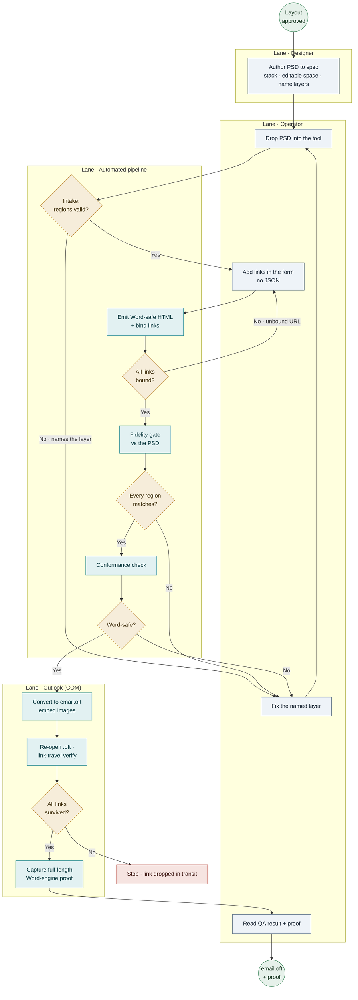

# PSD → Outlook — Tool Briefing

*Status as of 2026-07-20 — core pipeline built and tested (527 passing / 0 failing). Claims are kept at the architecture level rather than to specific code lines.*

## What this is

A small tool that turns a designer's Photoshop email (`.psd`) into a working, editable, **classic-Outlook `.OFT`** template — no hand-coded HTML — with an automatic quality gate at every step.

It doesn't replace the Figma → HTML pipeline. It **closes the OFT leg that isn't done yet**, and it covers the PSD-led client work Figma doesn't: Figma-fluent designers keep the Figma path; PSD-led projects get continuity and an upsell.

This started from coffee chats — asking Claudia and Daphne what their pain points are, and hearing that the design team is bottlenecked on OFT production; they named both Figma and PSD as their working files. Given my familiarity with Photoshop, I prototyped PSD → OFT. Claudia and Daphne have already seen the prototype and asked for more — specifically EML and modern Outlook (see *Inputs, outputs & clients*). I'm happy to keep building it or fold it into whatever's already in motion.

The briefing below reflects a full internal review of the tool — what works, what's half-built, the known bugs, and the security surfaces — distilled into what the team needs to decide how it fits.

---

## 1 · What it is & who it's for

### What ships editable, and what ships as a picture — the go/no-go rule

There is one rule that decides it, and it's mechanical, not a judgment call:

- **If a designer put it on a live *text layer* (and named it per the SOP), it ships as live, editable text.** Headings, body copy, stats, merge fields (`[First Name]`), and CTA button labels + their links all come through selectable and editable. A recipient can retype them and they reflow.
- **If it's inherently a *picture* — a photo, a logo, a decorative or vector graphic — it ships as an embedded image.** Not editable, by design; that's what it was in the PSD.

| Region | Ships as | Editable in Outlook? |
|---|---|---|
| Editable field (merge / fill-in) | live text | **Yes** — personalized per recipient |
| Live text (headings, body, stats) | live text | **Yes** — selectable, reflows |
| CTA / link | live button + working link | **Yes** |
| Image | picture (embedded) | No |
| Graphic (flattened) | one flattened picture | No |
| Background | cell / row fill | n/a |

### The editable-copy guarantee, and where it stops

The tool will not silently flatten editable text into a picture. Two independent code paths each refuse it: a layout-time safety check halts the run if live text ended up baked into a non-text region, and a render-time guard refuses to mark a merge field, heading, or CTA as "render-as-image" at all — the code that would flatten a classified fill-in raises instead of running. Two guards at two different stages, so a bug in one is still caught by the other. This holds on any PSD authored to the SOP — text on text layers, named per convention.

**Two cases people ask about.** *Text overlapping an image:* classification looks at the layer's group name first and its geometry second. Text inside a group named `... graphic` or `... button` is meant to be part of the picture and is baked with it; free-standing text that overlaps an image but isn't grouped into it stays live. The hard rule holds either way — if live copy ever ends up baked into a picture, the run stops. The honest limit: there's no detector for "live text sitting on an image that the designer *meant* to flatten but never grouped"; that text stays live, and it's the fidelity gate and the human proof, not this guarantee, that would catch the divergence. *A font Outlook won't accept:* an unknown font falls back to a Word-safe stack (Arial / Helvetica / sans-serif) and logs a warning — it never emits a web-font rule that classic Outlook would quietly swap to Times New Roman. If the exact font *file* isn't installed on the machine running the tool, the email still renders, but the tool can't measure the text to certify line-wrapping — so it flags that and leans on the capture proof, because a long line could wrap differently under Word than in the preview.

What it doesn't claim: the guarantee protects every region the tool *classified as editable* — if it identified a fill-in, that fill-in won't be flattened — but it doesn't separately guarantee that every editable region was identified correctly (detection is heuristic; see below). And if a designer bakes a fill-in spot *into* a picture, against the SOP, there's no live text there to protect — so instead of shipping a frozen name, the tool fails loud at intake and names the layer to free up (what that message looks like, and what the operator does with it, is in the next section).

### How region detection works, how mistakes are contained, and what a person sees

The tool classifies every object from three signals *together* — layer **naming** (`highlight`, `button`, `bg`, `graphic`), **geometry** (overlap, containment, stacking order), and **type** (text layer vs shape). It's heuristic, so misattribution is possible; the known softer cases are multi-highlight overlaps and an unrecognized role defaulting to body text. Three nets contain a mistake so it's caught rather than shipped:

1. **Intake fails loud and names the layer** when the file breaks the authoring rules.
2. **The fidelity gate** compares the render region-by-region against the PSD, so a visual misattribution surfaces as a concrete mismatch.
3. **The editability guard** makes the *dangerous* direction of a mistake (a fill-in turned into a picture) a hard stop.

**What "names the layer" actually means:** When intake refuses a file, it prints a plain refusal that starts with `REFUSED` and then lists, one line each, the exact layer(s) at fault and why — e.g. *"layer 'FirstName' sits inside a graphic region."* In the drag-drop app that text lands in the run-log pane on screen (and in a `run_summary.json` beside the output). The action is direct: open the PSD, find the layer by that name, move or rename it per the SOP, and re-drop the file. No code, no logs to decode — a layer name and a one-line reason.

**On making detection deterministic.** It's heuristic only because the tool *infers* a region's role when the PSD doesn't state it. The naming convention already removes most of the guesswork — a group named `graphic`, `button`, `bg`, or `highlight` is matched on its exact trailing word (so "infographic" is not "graphic"), which is fully deterministic. What's left to inference is the two soft cases: an unnamed/unrecognized region defaulting to body text, and overlapping highlights. The path to fully deterministic is to require an explicit role tag on every region in the PSD, so nothing is ever inferred — a roadmap item, not a rewrite. In the meantime, misattribution is contained three ways: author to the naming convention (the strong, exact-matched signal); the three nets above catch or flag a wrong call instead of shipping it; and the capture proof beside the PSD is the last visual check before anything goes out.

### Who operates it — and what has to be installed

Anyone who can author a PSD to the spec and run a drag-drop app can operate it — **no HTML skill required** — but "anyone" has a real hardware condition attached, so state it plainly: the OFT half of the pipeline drives **classic desktop Outlook** through automation, so **it runs on Windows with classic Outlook installed.** (The PSD-reading, layout, and fidelity-check stages run without Outlook; producing and verifying the actual `.OFT` needs it — see *The workflow* for the exact split.) The SOP (`docs/PSD-for-HTML_Authoring-SOP.md`) makes authoring paint-by-numbers so it isn't dependent on one person.

---

## 2 · The workflow, paint-by-numbers

### What you need to run it

- **For the whole pipeline (produce + verify the `.OFT`):** Windows, classic desktop Outlook installed, Python with the tool's package installed. That's the operator's machine.
- **For authoring only (design the PSD):** just Photoshop — the designer never needs to touch the tooling.

### The steps

- Circles = events
- Rectangles = tasks
- Diamonds = the fail-loud gateways

Every diamond that fails routes back to a fix-and-re-run — nothing bad passes downstream.

1. **Author / receive the PSD** — designed to the authoring spec (so it converts cleanly). Client-led PSD projects come in this way already.
2. **Review the components** — the intake check reads the PSD and sorts every object into the regions above; it fails loudly if something's off (e.g. a merge field that would get flattened), rather than shipping a silent defect.
3. **Add the links.** There are two ways in, for two kinds of user:
   - **Non-technical (the normal path):** in the drag-drop app, click **"Edit links…"**. The tool reads the PSD and shows a plain form — **one row per real button/image it found**, labelled *Button* or *Image*. Type the URL next to each. It saves the link file for you; **you never see or edit JSON.**
   - **Technical:** drop a `<psd-name>.links.json` manifest next to the PSD (auto-detected by name), or pass `--links` on the command line. Same result; useful for scripted/batch runs.
4. **Run it** — drop the PSD; the tool runs six gated stages and streams them green in the log pane. ~60–120s.
5. **QA / compare** — the fidelity gate renders the output and compares it **region-by-region against the PSD itself**, automatically, as a built-in stage (not a step anyone has to remember). A full-length Word-engine screenshot is captured as proof beside the design.
6. **Out comes** the `.OFT` template + the HTML bundle + the proof.

### What "fails loudly" means — the four stop points

The run stops and raises. There are four places it can stop, and each one tells the operator something they can act on:

| Where it stops | What tripped it | What the operator sees | What they do |
|---|---|---|---|
| **Intake** | PSD breaks an authoring rule (e.g. a fill-in baked into a graphic) | `REFUSED` + the exact **layer name** and reason | Fix that layer in the PSD, re-drop |
| **Layout safety check** | live text got trapped in a non-text region | `REFUSED — safety invariant violated` + the layer(s) | Same — free the named layer, re-drop |
| **Editability guard** | something tried to flatten a merge field / heading / CTA | run halts before it can | Same |
| **Conformance check** | HTML isn't Word-safe | the rule that failed | Re-run once the offending element is fixed (usually upstream in the PSD) |

**The deeper stops speak plainly too.** The first two are written for a non-technical operator (a layer name and a plain reason), and the deeper ones now are as well: an Outlook/COM fault reads as an environment issue on that machine rather than a problem with the PSD, a missing font says so plainly and points at the capture proof, and any *unexpected* error gives a bounded "this isn't your PSD — send this run id" message instead of a raw traceback. Every run also leaves a `run_summary.json`. The one still-terse surface is a raw conformance-rule violation — rare, and fixed upstream in the PSD.

### Why you can trust the QA surface — and its one real blind spot

Two QA layers run, and it's worth being precise about what each can and can't see:

1. **The automated fidelity gate** is **tamper-tested** — tests deliberately corrupt the output (wrong color, wrong line count, a moved region) and assert the gate *catches* them, so its detection is proven against known defects, not assumed — and it runs automatically as stage 2 of the pipeline, failing the run on any mismatch. Its limit: it renders in a fast Chromium proxy, not Outlook's Word engine. So it reliably catches geometry, region, and color drift that a browser reproduces — but a defect the *Word engine itself* introduces ("white block renders grey," see B4 below) can look fine in Chromium and pass.
2. **The full-length Word-engine capture proof** is the backstop for exactly that: a screenshot of the *real* classic-Outlook render, placed beside the PSD for a human to compare. Word-specific artifacts the proxy can't see show up here.

The remaining calibration item (both layers): the gate's thresholds are tuned to one corpus so far; broadening to a second brand is in §5.

---

## 3 · Inputs, outputs & clients

**Inputs:** one PSD authored to the spec, and the link URLs (entered in the "Edit links…" form, or a manifest).

**How it knows what a link slot is, and what happens with extra links.** The slots aren't free-form — they come from the PSD itself: every named button is a slot, a short piece of text containing a link word (unsubscribe, privacy, terms, learn more…) is a slot, and each image/CTA gets an addressable region. The "Edit links…" form shows exactly one row per real slot it found — discovered by running the same pipeline the real conversion uses — so a non-technical user can only put a URL where a slot actually exists. If a URL is supplied (via a hand-written manifest) that matches no real slot, it's a *promised-but-unbound* link: the pipeline lists it as `UNBOUND` and stops before producing the `.OFT` — fix the manifest or the PSD. So you can't quietly add more links than the design has slots; an extra one fails the run rather than shipping a dead link.

**Outputs:**
- `email.oft` — the shippable **classic-Outlook template**.
- An HTML bundle (`index.html` + embedded image assets + a links report).
- A capture proof — the machine's own full-length screenshot of the Word-engine render, matched to the PSD.
- A link report confirming every URL bound and survived **into the produced `.OFT`** (not just into the authored HTML).

**Which client:** The target today is classic desktop Outlook, which renders through the *Word* engine — the hardest target there is; the tool is built and gated specifically for it. It includes live/editable text, merge fields, working links, embedded imagery, and backgrounds. It does **not** yet cover other clients (web Outlook, Apple Mail, Gmail, mobile), the tool is proven end-to-end on **one** email so far, and multi-email artboards beyond the first are unverified.

**The capture proof** renders the email full-length: the tool grabs the whole body in one pass and pages any overflow, so there's no length limit on the proof. Hardening that capture step into a long-lived worker (instead of the current spike script) is a roadmap item.

**What is "late-bound copy."** The tool reads text, and its **line breaks**, from the PSD at the moment it runs. If copy is still changing *after* that — a stat edited, a headline reworded once the PSD's been sampled — the delivered email uses the client's natural word-wrap for the changed line rather than the designer's exact hand-placed breaks. The rule that prevents it is already standard: the PSD is the source of truth — finalize copy in the PSD, then run (or re-run) the tool once copy is final.

**Extending the surface — EML, modern Outlook, other clients** *(what Claudia & Daphne asked for).* The tool targets the *hardest* client on purpose, so extending is mostly **packaging + relaxing constraints + testing, not a rebuild** — and because the pipeline passes a clean data contract between stages, a new output target is a new final step consuming the same solved layout; the PSD-reading and layout-solving core doesn't change.

- **EML:** the tool already produces the HTML + embedded (cid) images; an `.eml` is that bundle in a standard MIME envelope. A packaging step on top of what exists.
- **Modern (new) Outlook:** renders through a **browser engine (WebView2/Chromium), not the Word engine** — *more* forgiving than classic. The tool already renders a Chromium fidelity proxy internally, close to what modern Outlook shows; support = a modern-Outlook capture/verify path, optionally dropping the Word-only scaffolding a browser doesn't need.
- **Gmail / Apple Mail / mobile:** browser/webkit-based and more standards-compliant than classic Outlook — the HTML would largely work, but each needs a test pass and probably a responsive profile (fixed-px tables don't reflow on phones). The cost is the testing, not the core.
- **Edge cases already tracked** (known, not surprises): late-bound copy (defined above), multi-email artboards beyond the first, uninstalled fonts, and 2×-authored text scaling.

---

## 4 · The bug list — how this architecture covers it

**The thesis:** most of these bugs are a tool **re-creating** the design and drifting from it. This new tool doesn't re-create — it **extracts** text and **measures** geometry from the design itself, then **checks** the output against it. That's why whole classes of these can't occur.

**The one guarantee that holds without caveat is B5 — copy hallucination.** There is no generative component anywhere in the pipeline; every character flows from the PSD's own text layers, so the tool has nothing that could invent a stat or fabricate a sentence. That's an architectural guarantee, not a fix. **B1 — copy changes** is nearly as strong on the half that matters most: the tool never *rewrites or regenerates* approved copy (it's extracted verbatim), so the "silently reworded" failure mode is designed out. It only *mitigates* — doesn't fully prevent — the *missing-words* half: a whole layer can drop if its parent is unreadable, and a word can wrap below the fold if a font is missing. Honest verdict: **prevents rewording, mitigates omission.**

Coverage for the rest — conservative verdicts, each with its honest caveat:

| Bug | How this architecture bears on it | Verdict | Honest caveat |
|---|---|---|---|
| **B5** copy hallucination | no generative component exists — copy can only come from a PSD text layer | **Prevented by construction** | the one clean claim; merge tokens like `[First Name]` pass through by design (not invented) |
| **B1** copy changes | text extracted verbatim, never regenerated or reworded | **Prevents rewording · mitigates omission** | can't fully prevent the *missing* half — a layer can drop on an unreadable parent, or a word wrap below the fold if a font's missing |
| **B8** CTA rounded vs squared | emitter writes no `border-radius`, and classic Outlook's Word engine ignores it anyway | **Prevented by construction** (reported defect) | an inability, not intelligence — the tool *can't* render rounded even when a design wants it |
| **B2** logo position/size | position + size **measured** from the PSD; row order = PSD top-coordinates | **Honors the design** | honors non-overlapping stacking; order across *overlapping* siblings is best-effort; multi-email (x>0) re-basing unverified; drift check is advisory |
| **B3** pink highlight missing | a real PSD fill behind text → character shading at the design's own color | **Honors the design (reduces, not eliminates)** | a fill spanning >1 line/layer is demoted to background — i.e. the multi-line callouts most likely reported missing |
| **B9** trademark superscripts too low | reads per-run superscript **baseline** → semantic `` | **Honors the attribute, not the rise** | live path defers the exact rise to Word's default; the 2×-PSD superscript fix is on this branch, not yet on `main` |
| **B7** paragraph spacing / bullet indent | Photoshop `SpaceAfter` → real `
` spacing | **Partial** | spacing is design-derived; bullet indent is a fixed 36px tuned to one corpus (only the `•`+tab form) |
| **B6** font weight off | variant-aware fonts carry the PSD's per-run weight | **Partial** | the semibold→weight mapping is single-corpus and can itself over-bold; final weight is Word's call |
| **B4** white renders grey | a per-region color check vs the PSD; raster bands ship the PSD's own pixels | **Shared risk — not a coverage win** | the automated gate renders in a **Chromium proxy, not the Word engine**, so a Word-introduced white→grey shift passes it; the human-reviewed capture proof (real Word render) is the backstop |

**Shared-risk note.** Where this tool wins and where it doesn't: it **prevents the *copy* failures outright** (B5, and the rewording half of B1) and **adds checks around the *rendering* failures** — but it does not inherently render better than any other tool once the bytes reach classic Outlook's Word engine, and that engine is the common enemy. Anything Word itself does — over-bolding a fallback font (B6), shifting a superscript's rise (B9), turning a white block grey (B4), wrapping a word below the fold (B1) — happens downstream of extraction, and correct extraction can't undo it. On color, weight, and superscript rise, we're exposed on the same axis the team is; the backstop for those is the human-reviewed Word-engine capture proof, not a promise. And the whole table assumes the PSD follows the authoring SOP; a file that ignores it can still be misattributed — the difference is this tool *fails loud or flags the mismatch* rather than shipping silently.

**Could a post-OFT transform fix the shared-risk items?** Partly. The `.OFT` stores HTML that Word *re-renders* every time it's opened; the distortion (a grey cast on white, a heavier weight) is produced at open-time, not stored in the file — so there's nothing in the artifact for a post-process pass to reach into. What *does* help is emitting more defensively so Word has less room to distort: forcing an explicit background color on every cell (already done) is exactly what suppresses the white→grey shift, and pinning per-run font-weight (already done) narrows the weight drift — but the recipient's installed fonts still decide the final face. So the lever is defensive emission plus the human capture proof to catch residue, not a post-OFT conform step.

Outlook's Word engine is brutal, and generative tools hallucinate — this tool's architecture wins on the copy class, and the rendering class is a shared risk.

---

## 5 · Current state — what's solid, and what's next

**Solid today:** the core engine — reading the PSD, solving the layout, deciding what stays editable, emitting Outlook-safe HTML — plus the fidelity, conformance, and link-travel gates. Exhaustively tested (527 passing / 0 failing), with fail-loud gates, structured run logging + a per-run `run_summary.json`, an install / clean-checkout guide + a pinned `requirements.lock`, and CI (ruff, CodeQL, semgrep, pip-audit) on every change. The fidelity gate runs automatically as a pipeline stage, and operator-facing failure messages now cover the deeper edge cases — an Outlook/COM fault reads as an environment issue, a missing font says so plainly, and an unexpected error gives a bounded message instead of a raw traceback.

**Security controls in place:**
- **URL-scheme allowlist** — `javascript:`, `data:`, `vbscript:`, and `file:` links are blocked at bind time; a blocked scheme surfaces as an unbound link and stops the run, so it never reaches the `.OFT`.
- **No code-execution paths** — no `eval` / `exec` / `shell=True` anywhere; the GUI launches the pipeline as an argument list (a PSD path with spaces or shell metacharacters can't inject); the Chromium proxy runs only static, literal JS.
- **Path-traversal containment** — asset resolution uses full-path prefix containment; the conformance check rejects absolute / drive / `..` paths; OFT-attachment extraction strips directory components (zip-slip guard).
- **Output escaping** — all emitted text is HTML/XML-escaped; the inline-link matcher escapes its patterns (no regex denial-of-service).
- **COM safety** — every Outlook script attaches to an existing Outlook or creates its own, and quits only what it started, so a shared Outlook is never torn down (no orphaned process, no lost drafts).
- **Dependency hygiene** — Pillow pinned past a known CVE; pip-audit / semgrep / CodeQL run in CI.

**Residual risks:** the trust model is local-CLI — the PSD and link manifest are treated as trusted internal inputs (the PSD is parsed with no path sandbox). Run outputs carry real personalization: the stored HTML and capture PNGs hold real merge fields and campaign URLs, unencrypted on disk and protected only by `.gitignore`; the sample link manifest with real campaign URLs is checked in. And by design the email keeps remote image/tracking URLs intact, so previewing it can fire a tracking beacon from the operator's machine. None block internal use; all deserve a decision before any external handoff.

**The roadmap — a few sprints scoped as PRDs, happy to sequence against whatever the team needs first:**
- **Production capture worker** — a long-lived Outlook process + single-slot queue + watchdog replacing the current spike capture script, plus automated tests for the Outlook-automation leg (the one surface without them today). The biggest reliability item; doable by us, faster with an engineer who knows COM/queues.
- **Cross-corpus generalization** — calibrate the visual thresholds (§4 B4/B7) to a second brand so "proven on one" becomes "proven generally." Data-gated: needs more sample emails.
- **Delivery-surface extension** — EML export and modern-Outlook support, each a new final step consuming the same solved layout (the EML + modern Outlook Claudia & Daphne asked for).

---

## 6 · SMEs & next steps

- **Point of contact / SME today:** Kai — happy to do a Loom walkthrough and a short training once we've settled how it fits.
- **SOP / 101:** `docs/PSD-for-HTML_Authoring-SOP.md` follows the team's requested structure (who can use it · the workflow · inputs/outputs/clients · SMEs), consolidating the authoring guidance so anyone on the team can, in principle, run it. Next pass: align its formatting and voice to the team's own SOP house style — pending a sample of an existing team SOP to match.
- **How it moves forward (options, no claim):**
  - Use it as the **interim path for PSD-led projects** now, while the Figma pipeline matures — it complements that effort and covers what it doesn't.
  - Bring it to the briefing with Francis as a working tool to review through the proper channels.
  - Decide together how it fits — I'm glad to keep hardening it *or* support a clean handoff, whatever helps the team; either way I'll stay close to it as the person who built it.
- **Helping the Figma leg.** Happy to co-author it with Jon while the kinks get worked out. There's a technical reason it's more than goodwill: the **OFT-conversion + link-verify + capture-proof + QA-gate layer here sits downstream of the *HTML*, not the PSD** — so with the Figma output made conformant to the same Word-safe rules, that whole back half could close the **OFT leg for the Figma pipeline too**, the exact leg it's stuck on. (Honest caveat: it needs the Figma HTML to pass the same conformance rules — some adaptation, not drop-in.)
- **A simpler route worth testing:** Figma can export to `.psd` via plugins, so Figma-led work could feed *this* PSD pipeline directly — potentially skipping a separate Figma leg altogether. The caveat is export fidelity: a Figma→PSD export may need layer cleanup (naming, grouping) to meet the authoring SOP, so it's worth a quick test on a real file before betting on it.
- **Working files** go to the shared SharePoint (*HTML Email Builder*); this briefing and the authoring SOP are the fastest way to get the full picture ahead of the call.

---

### Companion doc
- **`PSD-for-HTML_Authoring-SOP.md`** — the operator/authoring SOP that ships with the tool, in the team's requested structure.
